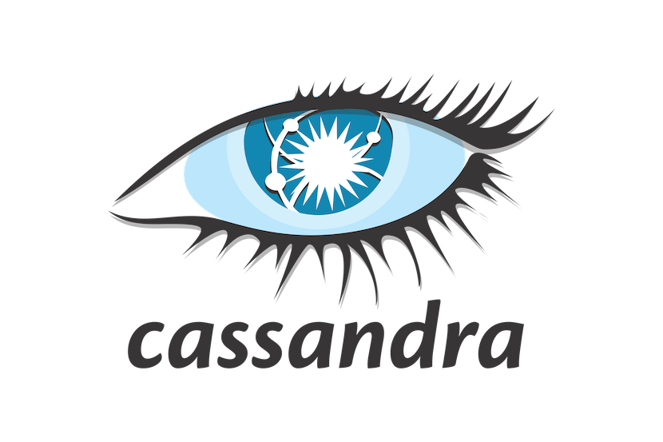

## 👋 Introduction

Hi there, I'm **Rubén Castillo**, a data science Master's student 🎓 with a keen interest in finance 💰 and `quantitative analysis` 📊. Furthermore, I have  prior experience as a backend developer 👨‍💻 and I also have a keen interest in artificial intelligence and machine learning models 🤖. Feel free to contact me anytime! 

&nbsp;

## 📫 Contact Me on Social Media
🌐 [LinkedIn](https://www.linkedin.com/in/ruben-castillo-carrasco/) | ✉️ [rubencastillok@gmail.com](mailto:rubencastillok@gmail.com)

&nbsp;

## 🧰 &nbsp;My toolbox

 &nbsp; &nbsp; &nbsp; &nbsp; &nbsp; &nbsp; &nbsp; &nbsp; &nbsp;

&nbsp;

## 💻 Open Source Work Stats

